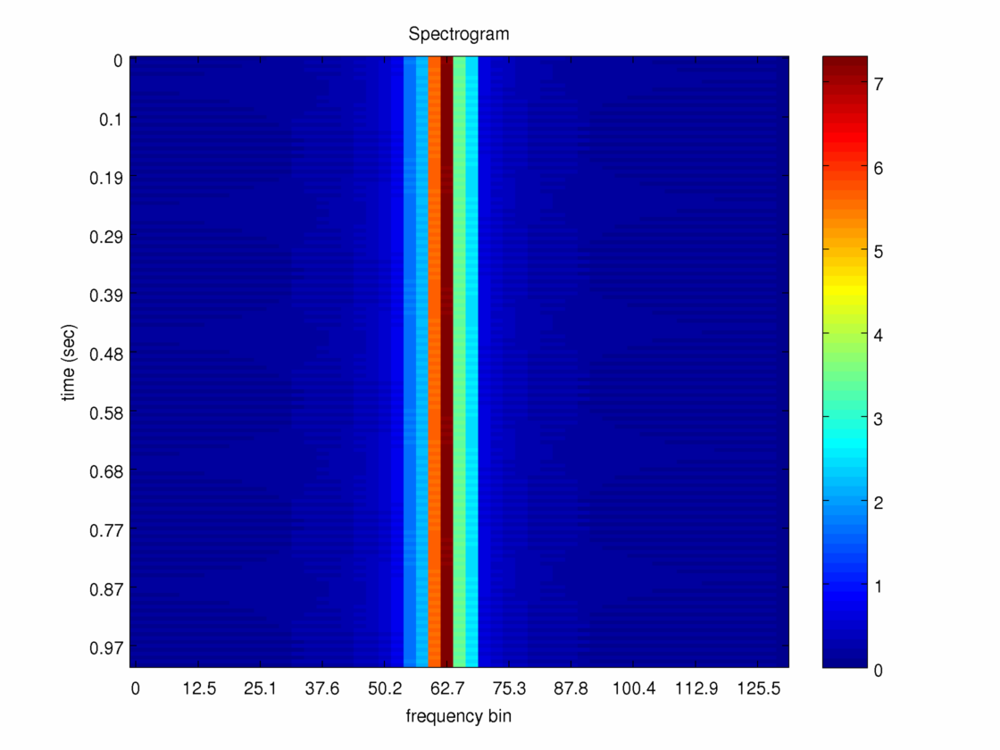

Needed:
------
1. FFTW
2. Boost::Circular_buffer

Compile:
-------
cmake based

Run:
----
build, copy the dpss*, *.m files to the build dir. 

plots.m: plots the figures
gen_dpss.m: generates the dpss files
myaa.m: used by plots.m

